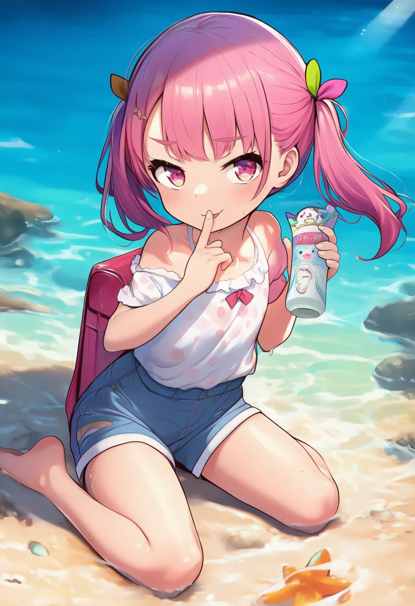
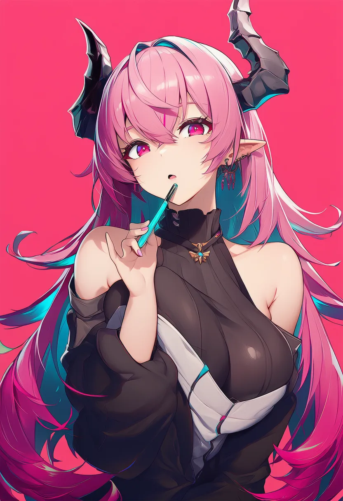
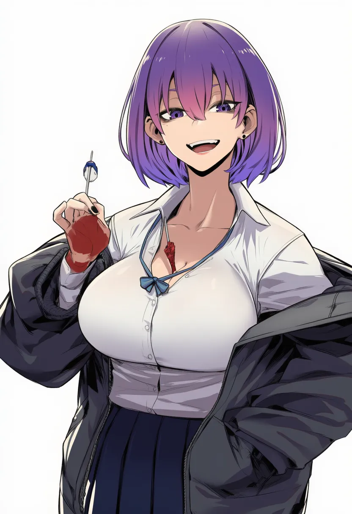

<h1 align="center">🎨 NovelAI OpenClaw Adaptor</h1>

<p align="center">
  将 NovelAI API 无缝接入 OpenClaw 的 OpenAI 格式中转适配器。
</p>

<p align="center">
  <strong>“解决 NovelAI 无法直接接入 OpenClaw 的核心痛点，提供简单易用的本地 OpenAI 兼容代理。”</strong>
</p>

<p align="center">
  
  
</p>

<p align="center">
  <a href="#quick-start">快速开始</a> ·
  <a href="#how-it-works">工作原理</a> ·
  <a href="./README.md">English</a> ·
  <a href="./README.ja.md">日本語</a>
</p>

<table>
  <tr>
    <td></td>
    <td></td>
    <td></td>
    <td></td>
  </tr>
  <tr>
    <td></td>
    <td></td>
    <td></td>
    <td></td>
  </tr>
</table>

## 为什么需要 NovelAI OpenClaw Adaptor？ 🌟

许多用户的核心痛点是：**NovelAI 的 API 无法直接接入 OpenClaw**，因为 OpenClaw 默认使用的是标准的 OpenAI API 格式。

为了解决这个问题，我们制作了这个 shim（中转适配器）。它能够接收来自 OpenClaw 的 OpenAI 格式请求，将其转换为 NovelAI 兼容的请求，并无缝返回生成的图片。

此外，它还支持一种极其简单的调用方式：你只需直接传入提示词（Prompt），即可直接生成图片，无需繁琐的配置！

<a id="quick-start"></a>

## 快速开始 🚀

📥 **安装：**

```bash
pip install novelai-openclaw-adaptor
```

⚙️ **初始化配置：**

```bash
novelai-config init
```

▶️ **启动文本模型中转：**

```bash
novelai-shim
```

🖼️ **生成图片：**

```bash
novelai-image --prompt "1girl, solo, masterpiece, best quality"
```

❓ **查看帮助：**

```bash
novelai-config --help
novelai-shim --help
novelai-image --help
```

**接入 OpenClaw：**

直接对 OpenClaw 说：

```text
帮我安装 novelai-openclaw-adaptor 然后新增一个 model provider “novelai”：pip install novelai-openclaw-adaptor && novelai-config --help
```

## 支持模型

**Shim 暴露的文本模型：**

- `glm-4-6`
- `erato`
- `kayra`
- `clio`
- `krake`
- `euterpe`
- `sigurd`
- `genji`
- `snek`

**图片 CLI 支持的生图模型：**

- `nai-diffusion-4-5-full`
- `nai-diffusion-4-5-curated`
- `nai-diffusion-4-full`
- `nai-diffusion-4-curated`
- `nai-diffusion-3`
- `nai-diffusion-3-furry`

<a id="how-it-works"></a>

## 工作原理 ✨

1. **本地代理：** 适配器在本地运行，并提供一个兼容 OpenAI 格式的接口（例如 `http://localhost:xxxx/v1`）。
2. **格式转换：** 当 OpenClaw 发送 OpenAI 风格的请求时，适配器会将其转换为 NovelAI 的专属参数。
3. **极简生图：** 支持直接传入提示词进行图片生成。
4. **配置方式：** 在 OpenClaw 中，你只需要将 `base_url` 配置为本地适配器的地址，并根据情况配置对应的模型名称即可。

## License 📄

本项目使用 `MIT` 协议。
